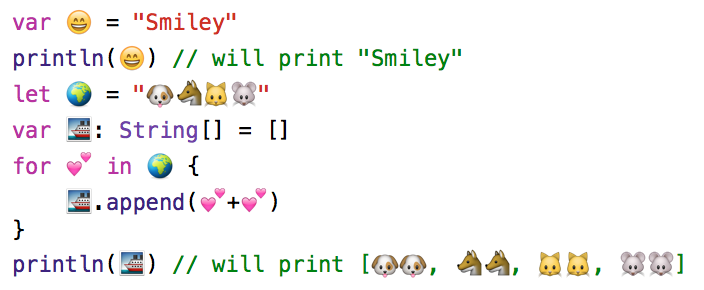

# Emoji/Unicode support

You can use any unicode character (including emoji) as variable names or in Strings.

```js
  var 😄 = "Smiley"                                 
  println(😄) // will print "Smiley"
  let 🌍 = "🐶🐺🐱🐭"
  var 🚢: String[] = []
  for 💕 in 🌍 {
      🚢.append(💕+💕)
  }
  println(🚢) // will print [🐶🐶, 🐺🐺, 🐱🐱, 🐭🐭]
```

**Which, in Xcode looks like**


